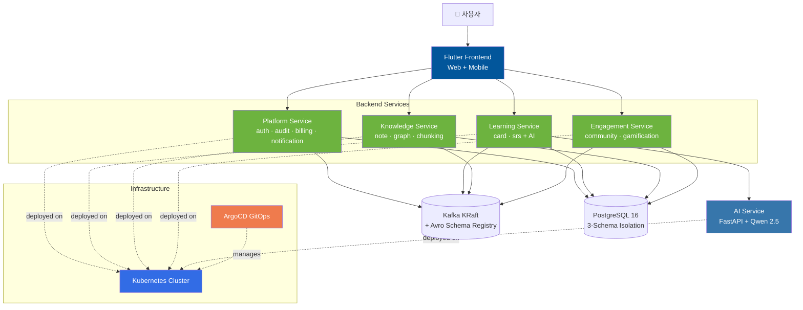

<div align="center">

# 🧠 Synapse

### 이벤트 기반 MSA 학습 플랫폼

**졸업 프로젝트** · 6인 팀 · 2026.05.12 ~ 2026.06.17


</div>

---

## 📖 프로젝트 소개

**Synapse**는 학습자의 노트·카드·커뮤니티 활동을 통합 관리하고 AI 학습 보조를 제공하는 **이벤트 기반 마이크로서비스 학습 플랫폼**입니다.

기존 LMS의 한계인 *모놀리식 구조에서 오는 확장성 제약*과 *학습 데이터 사일로* 문제를, **4개 마이크로서비스 + Kafka 이벤트 버스 + GitOps 배포 파이프라인**으로 해결하는 것을 목표로 설계되었습니다.

### 🎯 차별점

- 🧩 **도메인 단위 MSA 분리** — 학습(SRS)·지식(노트/그래프)·플랫폼(인증/빌링)·참여(커뮤니티)를 독립 서비스로
- 🔁 **이벤트 기반 통신** — Kafka + Avro Schema Registry로 서비스 간 결합도 최소화
- 🤖 **Polyglot AI 통합** — Java 메인 + Python(FastAPI) AI 서비스 분리
- 🚀 **GitOps 자동 배포** — ArgoCD ApplicationSet 기반 선언적 배포

---

## 🏗️ 시스템 아키텍처



### 핵심 패턴

| 패턴 | 적용 영역 |
|---|---|
| **Transactional Outbox** | 모든 백엔드 서비스의 도메인 이벤트 발행 |
| **Saga Orchestrator** | 서비스 간 분산 트랜잭션 (예: 결제 → 학습 활성화) |
| **Schema Registry** | Avro 기반 이벤트 스키마 버전 관리 |
| **GitOps (Pull-based)** | ArgoCD ApplicationSet으로 환경별 자동 동기화 |
| **3-Schema Isolation** | 서비스별 DB 격리, 단일 PostgreSQL 클러스터 비용 효율 |

---

## 🛠️ 기술 스택

| 영역 | 기술 |
|---|---|
| **Backend** | Spring Boot 4 · Java 21 · Spring Security · Spring Data JPA · QueryDSL |
| **AI Service** | Python 3.12 · FastAPI · Qwen 2.5 (vLLM, Ollama) · ChromaDB |
| **Frontend** | Flutter · Riverpod · GoRouter · Dio |
| **Event Bus** | Apache Kafka (KRaft) · Avro · Schema Registry |
| **Database** | PostgreSQL 16 (+ pgvector) · Redis |
| **Infrastructure** | Kubernetes · ArgoCD · Docker · Helm |
| **Observability** | Prometheus · Grafana · Loki · Tempo |
| **Build & CI** | Gradle · npm · GitHub Actions |

---

## 📁 레포지토리 가이드

### 🟢 Backend Microservices

| 레포 | 도메인 | 핵심 책임 |
|---|---|---|
| [`synapse-platform-svc`](../../synapse-platform-svc) | Platform | 인증 · 감사 · 빌링 · 알림 |
| [`synapse-learning-svc`](../../synapse-learning-svc) | Learning | 학습 카드 · SRS 알고리즘 + AI 학습 보조 |
| [`synapse-knowledge-svc`](../../synapse-knowledge-svc) | Knowledge | 노트 · 지식 그래프 · 문서 청킹 |
| [`synapse-engagement-svc`](../../synapse-engagement-svc) | Engagement | 커뮤니티 · 게이미피케이션 |

### 🔵 Frontend

| 레포 | 내용 |
|---|---|
| [`synapse-frontend`](../../synapse-frontend) | Flutter 기반 Web + Mobile 통합 클라이언트 |

### 🟠 Infrastructure & Shared

| 레포 | 내용 |
|---|---|
| [`synapse-gitops`](../../synapse-gitops) | Kubernetes 매니페스트 + ArgoCD ApplicationSet |
| [`synapse-shared`](../../synapse-shared) | Avro 이벤트 스키마 + 공통 라이브러리 |

### 📚 Documentation & Tooling

| 레포 | 내용 |
|---|---|
| [`syn`](../../syn) | 부트스트랩 스크립트 · 스펙 · 프로젝트 문서 모노레포 |
| [`documents`](../../documents) | 프로젝트 문서 · 화면 정의서 · ERD 등 |
| [`storyboard`](../../storyboard) | 스토리보드 (HTML) |
| [`schedule`](../../schedule) | 개발 일정 관리 |
| [`workflow-guide`](../../workflow-guide) | Git/PR 워크플로우 가이드 |
| [`workflow-dashboard`](../../workflow-dashboard) | 팀 워크플로우 대시보드 |
| [`synapse-data-mocking`](../../synapse-data-mocking) | 개발용 목업 데이터 생성 |
| [`synapse-prototype`](../../synapse-prototype) | 초기 프로토타입 |
| [`preview`](../../preview) | 프리뷰 도구 |

---

## 👥 팀

| 역할 | 담당 |
|---|---|
| **책임개발자 (Team Lead)** | **김민구** — 전체 아키텍처 설계 총괄 · 인프라(K8s + GitOps) · 이벤트 스키마 |
| Backend / Frontend / AI | 팀원 5명 분담 |

---

## 📊 프로젝트 진행 상황

```
✅ 아키텍처 설계 완료
✅ 4개 마이크로서비스 골격 구축
✅ Avro 이벤트 스키마 정의
✅ Kubernetes 매니페스트 + ArgoCD 파이프라인 구축
✅ Flutter 프론트엔드 기본 화면 구축
🔄 도메인 로직 구현 진행 중
🔄 통합 테스트 진행 중
⏳ 최종 배포 및 데모 (2026.06.17 예정)
```

---

## 🔗 관련 링크

- 📂 [전체 레포지토리 목록](https://github.com/orgs/team-project-final/repositories)
- 📖 [프로젝트 문서](https://github.com/team-project-final/documents)
- 📝 [기술 블로그 (책임개발자)](https://mg-tech-archive.inblog.io/)

---

<div align="center">

**Synapse** · MSA 기반 차세대 학습 플랫폼 · 2026

</div>
