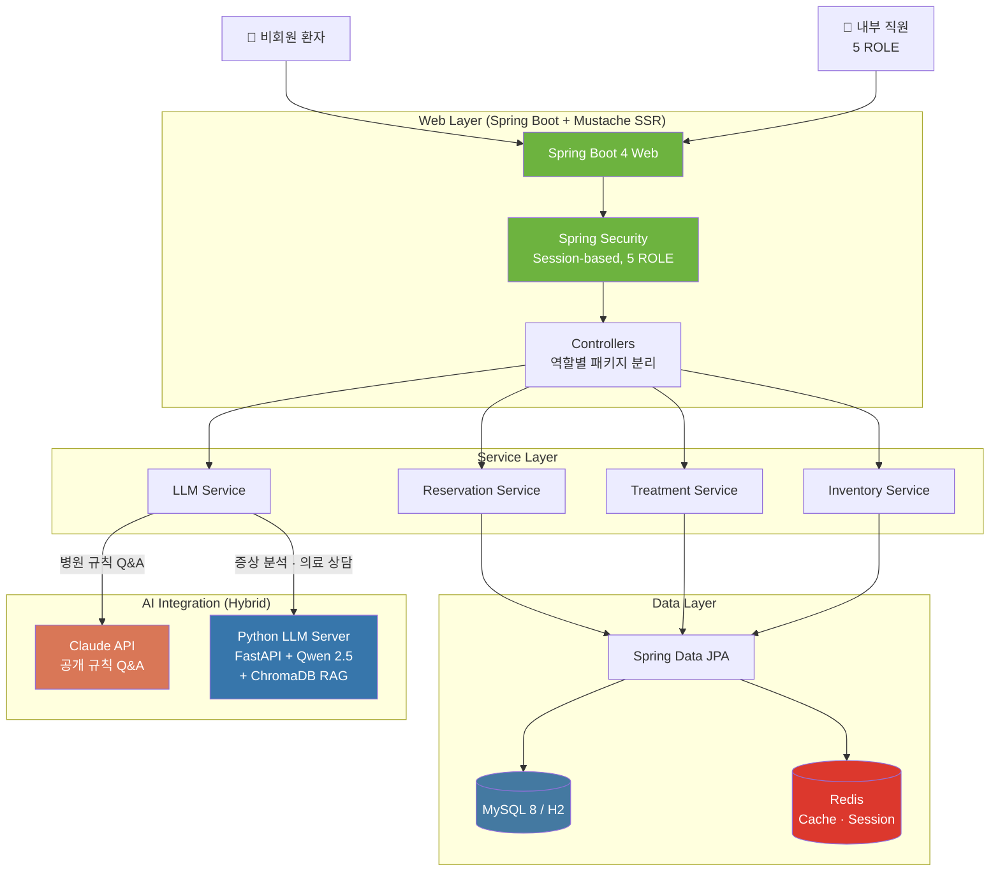

<div align="center">

# 🏥 HMS

### 병원 예약 & 내부 업무 시스템

**PBL 팀 프로젝트 · 4인 팀 · 2026.02.26 ~ 2026.03.26 (4주)**


</div>

---

## 📖 프로젝트 소개

**HMS(Hospital Management System)**는 중소 규모 병원의 예약·접수·진료·관리 업무를 통합한 사내 운영 시스템으로, **5개 직무별 권한 분리 + AI 증상 추천 + 병원 규칙 Q&A 챗봇**을 제공합니다.

기존 병원 시스템의 한계인 *복잡한 권한 관리*와 *비회원 환자의 부정확한 진료과 선택* 문제를, **세션 기반 5단계 ROLE 분리 + 하이브리드 AI 아키텍처(자체 호스팅 LLM + Claude API)**로 해결합니다.

### 🎯 차별점

- 🔐 **5개 ROLE 권한 분리** — ADMIN / STAFF / DOCTOR / NURSE / ITEM_MANAGER
- 🤖 **하이브리드 AI** — 민감 의료 상담은 자체 호스팅(Qwen 2.5), 공개 규칙 Q&A는 Claude API → 비용·프라이버시 동시 해결
- 📊 **검증된 품질** — 249개 테스트 케이스 100% 통과
- 📚 **완성된 문서 체계** — PRD·ERD·API·아키텍처·테스트 전략 등 16개 카테고리

---

## ✨ 핵심 기능

### 비회원 환자

- AI 증상 입력 → 진료과·의사 자동 추천 예약
- 진료과·의사 직접 선택 예약
- 예약번호 발급

### 내부 직원 (역할별 분리)

| 역할 | 핵심 업무 |
|---|---|
| 🛡️ **ADMIN** | 예약·환자·직원·진료과·물품·병원 규칙 전체 관리 · 대시보드 |
| 👤 **STAFF** | 전화 예약 등록 · 방문 접수 · 접수 처리 · 물품 사용 |
| 👨‍⚕️ **DOCTOR** | 오늘 진료 목록 · 진료 기록 입력 · 병원 규칙 Q&A 챗봇 |
| 👩‍⚕️ **NURSE** | 예약 현황 조회 · 환자 정보 수정 · 병원 규칙 Q&A 챗봇 |
| 📦 **ITEM_MANAGER** | 물품 입고·출고·재고 관리 · 사용 이력 · 대시보드 |

---

## 🏗️ 시스템 아키텍처



### 하이브리드 AI 설계 의도

| 기능 | LLM 선택 | 이유 |
|---|---|---|
| 병원 규칙 Q&A | Claude API | 공개 정보 · 고품질 응답 우선 |
| 증상 분석 / 의료 상담 | Qwen 2.5 (자체 호스팅) | 민감 의료 데이터 · 외부 전송 회피 |

---

## 🛠️ 기술 스택

| 영역 | 기술 |
|---|---|
| **Backend** | Spring Boot 4 · Java 21 · Spring Security · Spring Data JPA |
| **View** | Mustache (SSR) · Tailwind CSS 4 · Lucide Icons · Chart.js · Flatpickr |
| **Database** | MySQL 8 (운영) · H2 (개발) · Redis (캐시·세션) |
| **AI (Java)** | Claude API (Anthropic) |
| **AI (Python)** | FastAPI · Qwen 2.5 (vLLM, Ollama) · ChromaDB RAG |
| **Test** | JUnit 5 · Mockito 5 · Spring MockMvc · REST Docs |
| **Build** | Gradle · npm |

---

## 📁 레포지토리 가이드

| 레포 | 내용 |
|---|---|
| [`hms`](../../hms) | **메인 애플리케이션** · Spring Boot 4 + Mustache SSR + Python LLM 서버 |
| [`documents`](../../documents) | **프로젝트 문서 16개 카테고리** · PRD · ERD · API · 아키텍처 · 테스트 전략 · 배포 가이드 |

---

## 📊 주요 성과

```
✅ 4주 일정 내 완성 (납기 100% 준수)
✅ 테스트 케이스 249건 100% 통과
   ├─ Controller (MockMvc): 130건
   ├─ Service (Unit):       100건
   ├─ Repository (DataJpa):   8건
   └─ Domain · DTO · 기타:    11건
✅ 도메인 12개 / REST API 89개 / 화면 40개+ / Mustache 템플릿 74개
✅ 16개 카테고리 문서 체계 구축
```

### 코드 구성 (`hms` 레포 기준)

- Java **52.0%** · Mustache **36.2%** · Python **7.5%** · JavaScript **3.4%** · CSS **0.6%**

---

## 👥 팀

| 역할 | 담당 |
|---|---|
| **책임개발자 (Team Lead)** | **김민구** — 아키텍처 설계 · Spring Security · JPA Entity · LLM 연동 · Python LLM 서버 · 배포 |
| 개발자 A | 비회원 예약 흐름 (`/reservation/**`) |
| 개발자 B | 내부 직원 화면 (`/staff/**` · `/doctor/**` · `/nurse/**`) + LLM UI |
| 개발자 C | 관리자 화면 (`/admin/**` · `/item/**`) |

---

## 🔗 관련 링크

- 📂 [전체 레포지토리 목록](https://github.com/orgs/proejct-team-alpha/repositories)
- 📖 [프로젝트 문서](https://github.com/proejct-team-alpha/documents)
- 🏥 [메인 애플리케이션 (hms)](https://github.com/proejct-team-alpha/hms)
- 📝 [기술 블로그 (책임개발자)](https://mg-tech-archive.inblog.io/)

---

<div align="center">

**HMS** · Spring Boot 4 기반 병원 통합 운영 시스템 · 2026

</div>
