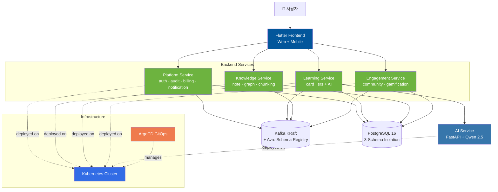
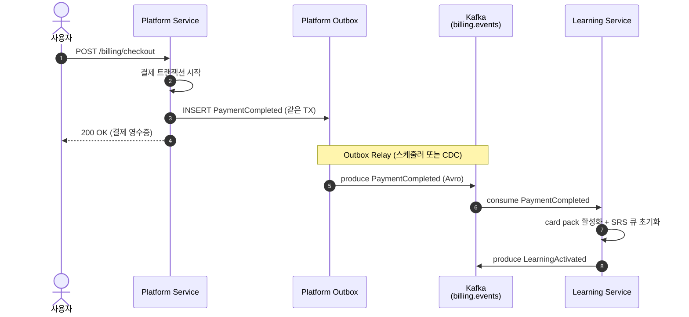

<div align="center">

# 🧠 Synapse

### 이벤트 기반 MSA 학습 플랫폼

> 학습자의 **노트·카드·커뮤니티 활동**을 통합 관리하고 AI 학습 보조를 제공하는, **Kafka 이벤트 버스 위의 마이크로서비스 4개**로 구성된 차세대 학습 플랫폼.

**졸업 프로젝트** · 6인 팀 · 2026.05.12 ~ 2026.06.17 · 진행 중

| 마이크로서비스 | 레포지토리 | 팀 규모 |
|:---:|:---:|:---:|
| **4개** | **20+** | **6인** |


</div>

---

## 🎯 차별점

- 🧩 **모놀리식 LMS의 확장성·도메인 사일로 문제** → 학습(SRS)·지식(노트/그래프)·플랫폼(인증/빌링)·참여(커뮤니티)를 **독립 마이크로서비스 4개**로 분리
- 🔁 **서비스 간 강결합·동기 호출 폭주 문제** → **Kafka + Avro Schema Registry**로 이벤트 기반 통신. Transactional Outbox로 발행 일관성 보장
- 🤖 **Java 메인 스택과 AI 생태계(Python)의 분리 운영 부담** → **Polyglot 마이크로서비스**. Java 서비스가 도메인 처리, FastAPI + Qwen 2.5 AI 서비스가 학습 보조 전담
- 🚀 **PR 머지 후 수동 배포 → 환경 드리프트** → **GitOps**. ArgoCD ApplicationSet으로 모든 서비스·환경을 선언적 동기화

---

## 🏗️ 시스템 아키텍처

> **한 줄 읽는 법**: Flutter 클라이언트가 4개 백엔드 서비스에 접근하고, 모든 도메인 이벤트는 Kafka로 발행되어 다른 서비스가 구독한다. Learning Service만 Python AI Service를 호출한다. 인프라는 K8s 위에서 ArgoCD가 선언적으로 관리한다.



### 핵심 패턴

| 패턴 | 적용 영역 |
|---|---|
| **Transactional Outbox** | 모든 백엔드 서비스의 도메인 이벤트 발행 |
| **Saga Orchestrator** | 서비스 간 분산 트랜잭션 (예: 결제 → 학습 활성화) |
| **Schema Registry** | Avro 기반 이벤트 스키마 버전 관리 |
| **GitOps (Pull-based)** | ArgoCD ApplicationSet으로 환경별 자동 동기화 |
| **3-Schema Isolation** | 서비스별 DB 격리, 단일 PostgreSQL 클러스터 비용 효율 |

---

## 🧭 설계 결정 노트

각 결정의 상세는 `documents` 레포의 ADR 문서에서 확인할 수 있습니다.

### ADR-0001 · Why MSA over Modular Monolith?

- **맥락**: 6인 팀 졸업 프로젝트에 MSA는 과한가? 학습·지식·플랫폼·참여 4개 도메인이 독립 진화·독립 배포 필요. 모듈러 모놀리식은 도메인 경계가 흐려질 위험
- **결정**: 4개 마이크로서비스로 시작. 단 **공통 인프라(K8s · Kafka · PostgreSQL 클러스터)는 공유**해 운영비를 모놀리식 수준으로 유지
- **트레이드오프**: ✅ 도메인 경계 강제 · 학습 효과 큼 · 졸업 후 각자 풀리퀘 운영 가능 / ❌ 통합 테스트·로컬 개발 환경 복잡 · 6인 팀이 4개 서비스 분담 시 1인 다역

→ [상세 결정 노트](https://github.com/team-project-final/documents/blob/main/decisions/0001-why-msa-over-modular-monolith.md)

### ADR-0002 · Why Kafka + Avro Schema Registry over REST?

- **맥락**: 서비스 간 통신을 동기 REST로 가면 결제 → 학습 활성화 같은 흐름에서 결제 서비스가 학습 서비스의 가용성에 종속. 이벤트 기반으로 가면 발행 일관성과 스키마 진화 문제 발생
- **결정**: Kafka 이벤트 버스 + Avro Schema Registry. 모든 도메인 이벤트는 Transactional Outbox로 발행. 스키마는 BACKWARD 호환성 강제
- **트레이드오프**: ✅ 서비스 가용성 결합 ↓ · 새 컨슈머 추가가 무료 · 이벤트 재처리 가능 / ❌ 디버깅 비용 ↑(트레이싱 필수) · 최종 일관성 모델로 사고 전환 필요 · 스키마 거버넌스 비용

→ [상세 결정 노트](https://github.com/team-project-final/documents/blob/main/decisions/0002-why-kafka-avro-over-rest.md)

### ADR-0003 · Why 3-Schema Isolation over Database-per-Service?

- **맥락**: MSA 정석은 서비스당 DB 1개. 그러나 6인 팀 프로젝트에서 PostgreSQL 클러스터 4개를 운영하는 비용·복잡도가 비현실적. 그렇다고 단일 스키마 공유는 격리가 없음
- **결정**: **단일 PostgreSQL 16 클러스터 + 서비스별 스키마 격리**. 서비스 계정은 자기 스키마에만 권한, 크로스 스키마 조인 금지
- **트레이드오프**: ✅ 운영비 4분의 1 · 백업·모니터링 단일 지점 · 격리는 충분 / ❌ 미래에 서비스가 정말 독립 DB 필요해지면 분리 비용 발생 · "물리 격리"는 아니므로 보안 요구사항 강해지면 재검토

→ [상세 결정 노트](https://github.com/team-project-final/documents/blob/main/decisions/0003-why-3-schema-isolation.md)

---

## 🔄 핵심 시나리오

### 결제 → 학습 활성화 Saga (Outbox 포함)

> 사용자가 학습 카드 팩을 구매하면, Platform Service의 결제가 완료된 후 도메인 이벤트가 Outbox 테이블 → Kafka → Learning Service로 흘러 학습이 활성화된다. Platform과 Learning 사이에 동기 호출은 없다.



---

## 📊 결과·성과

```
✅ 아키텍처 설계 완료
✅ 4개 마이크로서비스 골격 구축
✅ Avro 이벤트 스키마 정의
✅ Kubernetes 매니페스트 + ArgoCD 파이프라인 구축
✅ Flutter 프론트엔드 기본 화면 구축
🔄 도메인 로직 구현 진행 중
🔄 통합 테스트 진행 중
⏳ 최종 배포 및 데모 (2026.06.17 예정)
```

**현 시점 진척률**: 설계·인프라·골격 100% / 도메인 로직 ~50% / 통합 테스트 시작 단계 (작성 기준 2026-05-23)

### 🛠️ 기술 스택

| 영역 | 기술 |
|---|---|
| **Backend** | Spring Boot 4 · Java 21 · Spring Security · Spring Data JPA · QueryDSL |
| **AI Service** | Python 3.12 · FastAPI · Qwen 2.5 (vLLM, Ollama) · ChromaDB |
| **Frontend** | Flutter · Riverpod · GoRouter · Dio |
| **Event Bus** | Apache Kafka (KRaft) · Avro · Schema Registry |
| **Database** | PostgreSQL 16 (+ pgvector) · Redis |
| **Infrastructure** | Kubernetes · ArgoCD · Docker · Helm |
| **Observability** | Prometheus · Grafana · Loki · Tempo |
| **Build & CI** | Gradle · npm · GitHub Actions |

---

## 👥 팀 & 책임 분담

| 역할 | 담당자 | 책임 영역 |
|---|---|---|
| **책임개발자 (Team Lead)** | **김민구** | 전체 아키텍처 설계(ADR-0001/0002/0003) · 인프라(K8s + ArgoCD GitOps) · Avro 이벤트 스키마 |
| Backend — Platform | — | auth · audit · billing · notification |
| Backend — Learning | — | card · SRS + Java 측 AI 게이트웨이 |
| Backend — Knowledge | — | note · graph · chunking |
| Backend — Engagement | — | community · gamification |
| Frontend / AI | — | Flutter Web + Mobile · Python AI Service |

> 팀원 5명의 실명·상세 책임은 진행 중. 도메인 매핑은 책임 영역의 1차 가이드라인.

---

## 📁 레포지토리 가이드

### 🟢 Backend Microservices

| 레포 | 도메인 | 핵심 책임 |
|---|---|---|
| [`synapse-platform-svc`](../../synapse-platform-svc) | Platform | 인증 · 감사 · 빌링 · 알림 |
| [`synapse-learning-svc`](../../synapse-learning-svc) | Learning | 학습 카드 · SRS 알고리즘 + AI 학습 보조 |
| [`synapse-knowledge-svc`](../../synapse-knowledge-svc) | Knowledge | 노트 · 지식 그래프 · 문서 청킹 |
| [`synapse-engagement-svc`](../../synapse-engagement-svc) | Engagement | 커뮤니티 · 게이미피케이션 |

### 🔵 Frontend

| 레포 | 내용 |
|---|---|
| [`synapse-frontend`](../../synapse-frontend) | Flutter 기반 Web + Mobile 통합 클라이언트 |

### 🟠 Infrastructure & Shared

| 레포 | 내용 |
|---|---|
| [`synapse-gitops`](../../synapse-gitops) | Kubernetes 매니페스트 + ArgoCD ApplicationSet |
| [`synapse-shared`](../../synapse-shared) | Avro 이벤트 스키마 + 공통 라이브러리 |

### 📚 Documentation & Tooling

| 레포 | 내용 |
|---|---|
| [`documents`](../../documents) | 프로젝트 문서 · 화면 정의서 · ERD · **ADR(decisions/)** |
| [`syn`](../../syn) | 부트스트랩 스크립트·스펙·프로젝트 문서 모노레포 (`documents`의 상위 메타 레포) |
| [`storyboard`](../../storyboard) | 스토리보드 (HTML 화면 흐름) |
| [`schedule`](../../schedule) | 개발 일정 관리 |
| [`workflow-guide`](../../workflow-guide) | Git/PR 워크플로우 가이드 |
| [`workflow-dashboard`](../../workflow-dashboard) | 팀 워크플로우 대시보드 |
| [`synapse-data-mocking`](../../synapse-data-mocking) | 개발용 목업 데이터 생성 |
| [`synapse-prototype`](../../synapse-prototype) | 초기 프로토타입 (현재 비활성) |
| [`preview`](../../preview) | 화면 프리뷰 도구 |

---

<div align="center">

**Synapse** · MSA 기반 차세대 학습 플랫폼 · 2026

[📂 전체 레포지토리](https://github.com/orgs/team-project-final/repositories) · [📖 프로젝트 문서](https://github.com/team-project-final/documents) · [📝 책임개발자 기술 블로그](https://mg-tech-archive.inblog.io/)

</div>
