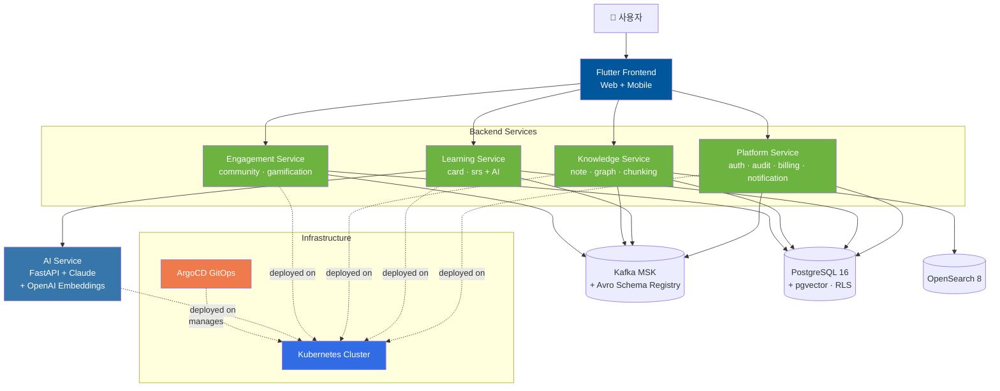
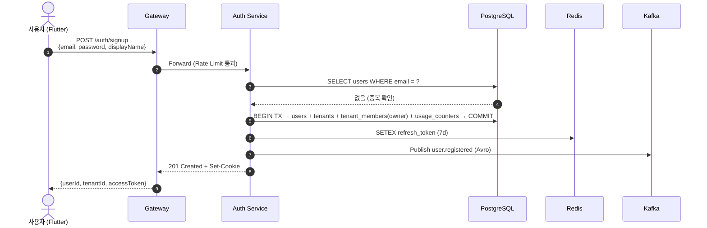
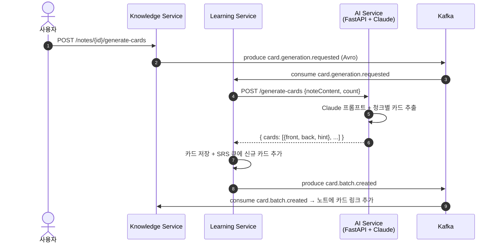

<div align="center">

# 🧠 Synapse

### 통합 학습-지식 그래프 SaaS

> **Obsidian + Anki + RAG**를 한 플랫폼에 융합. 마크다운 노트 → 위키링크 지식 그래프 → AI 자동 플래시카드 → SM-2 간격 반복 → 학습 그룹 공유.

> *"노트가 카드가 되고, 복습이 노트를 다시 살린다."*

**졸업 프로젝트** · 7인 팀(팀장 1 + 6) · 2026.05.12 ~ 2026.06.15 · 발표 06.15 · 진행 중

| 마이크로서비스 | 레포지토리 | 팀 규모 |
|:---:|:---:|:---:|
| **4개** | **10개** | **7인** |


</div>

---

## 🎬 라이브 데모

> **GitHub Pages에 배포된 6개의 인터랙티브 자료**. 코드만이 아니라 설계·흐름·화면을 직접 둘러볼 수 있다.

| | 무엇 | 한 줄 설명 |
|---|---|---|
| ⭐ | [**Flow Simulator**](https://team-project-final.github.io/synapse-flow-simulator/) | **18개 시나리오** 인터랙티브 아키텍처 시뮬레이터 (인증·AI·장애복구·GitOps 등) · 아키텍처/시퀀스/UX **3 뷰** + 재생 속도 0.25–2× + 로그 패널 |
| 🖼️ | [Storyboard v1.0](https://team-project-final.github.io/storyboard/) | 화면 정의서 슬라이드 (키보드 네비게이션 지원) |
| 🌐 | [Product Landing](https://team-project-final.github.io/synapse-prototype/) | "통합 학습-지식 그래프 SaaS" 제품 랜딩 |
| 📘 | [GitOps Runbook](https://team-project-final.github.io/synapse-gitops/) | `synapse_runbooks` — 운영 가이드 |
| 🧪 | [Mocking Playground](https://team-project-final.github.io/synapse-data-mocking/) | 개발용 mock 데이터 생성·조작 도구 |
| 📋 | [Workflow Guide](https://team-project-final.github.io/workflow-guide/) | Git/PR 워크플로우 가이드 |

> 가장 추천: **Flow Simulator** — 30초 안에 이벤트 기반 MSA가 실제로 어떻게 동작하는지 눈으로 확인할 수 있다.

---

## 🎯 차별점

- 🧩 **모놀리식 LMS의 확장성·도메인 사일로 문제** → 학습(SRS)·지식(노트/그래프)·플랫폼(인증/빌링)·참여(커뮤니티)를 **독립 마이크로서비스 4개**로 분리
- 🔁 **서비스 간 강결합·동기 호출 폭주 문제** → **Kafka + Avro Schema Registry**로 이벤트 기반 통신. Transactional Outbox로 발행 일관성 보장
- 🤖 **Java 메인 스택과 AI 생태계(Python)의 분리 운영 부담** → **Polyglot 마이크로서비스**. Java가 도메인 처리, FastAPI + **Anthropic Claude + OpenAI Embeddings** AI 서비스가 노트→카드 자동 생성·RAG 검색 전담
- 🚀 **PR 머지 후 수동 배포 → 환경 드리프트** → **GitOps**. ArgoCD ApplicationSet으로 모든 서비스·환경을 선언적 동기화

---

## 🏗️ 시스템 아키텍처

> **한 줄 읽는 법**: Flutter 클라이언트가 4개 백엔드 서비스에 접근하고, 모든 도메인 이벤트는 Kafka로 발행되어 다른 서비스가 구독한다. Learning Service만 Python AI Service를 호출한다. 인프라는 K8s 위에서 ArgoCD가 선언적으로 관리한다.



### 핵심 패턴

| 패턴 | 적용 영역 |
|---|---|
| **Transactional Outbox** | 모든 백엔드 서비스의 도메인 이벤트 발행 |
| **Saga Orchestrator** | 서비스 간 분산 트랜잭션 (예: 결제 → 학습 활성화) |
| **Schema Registry** | Avro 기반 이벤트 스키마 버전 관리 |
| **GitOps (Pull-based)** | ArgoCD ApplicationSet으로 환경별 자동 동기화 |
| **3-Schema Isolation** | 서비스별 DB 격리, 단일 PostgreSQL 클러스터 비용 효율 |

---

## 🧭 설계 결정 노트

각 결정의 상세는 `documents` 레포의 ADR 문서에서 확인할 수 있습니다.

### ADR-0001 · Why MSA over Modular Monolith?

- **맥락**: 7인 팀(팀장 1 + 6) 졸업 프로젝트에 MSA는 과한가? 학습·지식·플랫폼·참여 4개 도메인이 독립 진화·독립 배포 필요. 모듈러 모놀리식은 도메인 경계가 흐려질 위험. 각 서비스 내부는 Modulith 패턴
- **결정**: 4개 마이크로서비스로 시작. 단 **공통 인프라(K8s · Kafka MSK · PostgreSQL 클러스터)는 공유**해 운영비를 모놀리식 수준으로 유지
- **트레이드오프**: ✅ 도메인 경계 강제 · 학습 효과 큼 · 졸업 후 각자 풀리퀘 운영 가능 / ❌ 통합 테스트·로컬 개발 환경 복잡 · 1인 다역(평균 1.4 트랙/인)

→ [상세 결정 노트](https://github.com/team-project-final/documents/blob/main/decisions/0001-why-msa-over-modular-monolith.md)

### ADR-0002 · Why Kafka + Avro Schema Registry over REST?

- **맥락**: 서비스 간 통신을 동기 REST로 가면 결제 → 학습 활성화 같은 흐름에서 결제 서비스가 학습 서비스의 가용성에 종속. 이벤트 기반으로 가면 발행 일관성과 스키마 진화 문제 발생
- **결정**: Kafka 이벤트 버스 + Avro Schema Registry. 모든 도메인 이벤트는 Transactional Outbox로 발행. 스키마는 BACKWARD 호환성 강제
- **트레이드오프**: ✅ 서비스 가용성 결합 ↓ · 새 컨슈머 추가가 무료 · 이벤트 재처리 가능 / ❌ 디버깅 비용 ↑(트레이싱 필수) · 최종 일관성 모델로 사고 전환 필요 · 스키마 거버넌스 비용

→ [상세 결정 노트](https://github.com/team-project-final/documents/blob/main/decisions/0002-why-kafka-avro-over-rest.md)

### ADR-0003 · Why 3-Schema Isolation over Database-per-Service?

- **맥락**: MSA 정석은 서비스당 DB 1개. 그러나 7인 팀 졸업 프로젝트에서 PostgreSQL 클러스터 4개를 운영하는 비용·복잡도가 비현실적. 그렇다고 단일 스키마 공유는 격리가 없음
- **결정**: **단일 PostgreSQL 16 클러스터 + 서비스별 스키마 격리**. 서비스 계정은 자기 스키마에만 권한, 크로스 스키마 조인 금지
- **트레이드오프**: ✅ 운영비 4분의 1 · 백업·모니터링 단일 지점 · 격리는 충분 / ❌ 미래에 서비스가 정말 독립 DB 필요해지면 분리 비용 발생 · "물리 격리"는 아니므로 보안 요구사항 강해지면 재검토

→ [상세 결정 노트](https://github.com/team-project-final/documents/blob/main/decisions/0003-why-3-schema-isolation.md)

---

## 🔄 핵심 시나리오

> **8개의 핵심 유저 플로우**가 wiki에 전체 시퀀스로 정리되어 있다. 여기서는 **회원가입(인증 도메인의 진입점)**과 **노트→카드 자동 생성(제품 핵심 가치)** 두 가지를 대표로 발췌.

전체 8개 시퀀스 다이어그램은 [📖 wiki — 05_화면_흐름_시퀀스_다이어그램](https://github.com/team-project-final/documents/wiki/05_화면_흐름_시퀀스_다이어그램) 에서 확인할 수 있다:

| # | 시나리오 | 강조 포인트 |
|---|---|---|
| 5.1 | **회원가입 + Tenant 생성** | 단일 TX에 user/tenant/usage_counters 묶어 Free 플랜까지 활성화 |
| 5.2 | OAuth 로그인 + MFA 검증 | Google ID Token + TOTP 30초 윈도우 |
| 5.3 | 노트 작성 + 위키링크 + 백링크 갱신 | Knowledge Service의 그래프 동기화 |
| 5.4 | **노트 → AI 플래시카드 자동 생성** | Learning Service ↔ AI Service(Claude) |
| 5.5 | SM-2 간격 반복 복습 세션 | SRS 알고리즘 + Redis 큐 |
| 5.6 | RRF 융합 검색 | PostgreSQL pgvector + OpenSearch 점수 융합 |
| 5.7 | 결제 → Tier 업그레이드 | Outbox + Saga |
| 5.8 | 학습 그룹 공유 + 알림 | Engagement → notification 이벤트 |

### 5.1 회원가입 + Tenant 생성 (Auth + Outbox 발행)



### 5.4 노트 → AI 플래시카드 자동 생성 (Polyglot 핵심 흐름)



---

## 📊 결과·성과

### 5주 로드맵

| 주차 | 기간 | 핵심 목표 | 상태 |
|:---:|---|---|:---:|
| **W1** | 05-12 ~ 05-16 | 인프라 + 서비스 골격 + 기본 CRUD | ✅ |
| **W2** | 05-19 ~ 05-23 | SRS 복습 엔진 · AI 골격 · Graph + ES · Schema Registry | 🔄 |
| **W3** | 05-26 ~ 05-29 (4일) | Kafka 이벤트 발행 + RRF 검색 + AI 카드 자동 생성 | ⏳ |
| **W4** | 06-01 ~ 06-05 (4일) | 이벤트 소비자 + notification/audit + 통합 검증 | ⏳ |
| **W5** | 06-08 ~ 06-12 | E2E 테스트 + 버그 수정 + 발표 준비 | ⏳ |
| **🎓** | **06-15 (월)** | **최종 발표 · 시연 · 제출** | ⏳ |

```
✅ 아키텍처 설계 완료 (ADR 3건 + Wiki 18종 정식 문서)
✅ 4개 마이크로서비스 골격 + 각 ARCHITECTURE.md
✅ Avro 이벤트 스키마 정의 (synapse-shared)
✅ K8s 매니페스트 + ArgoCD ApplicationSet (synapse-gitops)
✅ Flutter 프론트엔드 기본 화면 구축
✅ CI/CD 3종 파이프라인 (ci.yml · mirror.yml · deploy.yml)
🔄 SRS 알고리즘 · AI 카드 생성 · Graph + 검색 구현 중
⏳ Kafka 발행자 → 소비자 → 통합 테스트
```

**현 시점 진척률**: 설계·인프라·골격 100% / W2 핵심 기능 구현 중 (기준 2026-05-23)

### 🛠️ 기술 스택

| 영역 | 기술 |
|---|---|
| **Backend** | Spring Boot 4 + **Modulith** · Java 21 · Gradle · Spring Security · Spring Data JPA |
| **AI Service** | Python 3.11 · FastAPI · **Anthropic Claude SDK** · **OpenAI Embeddings SDK** |
| **Frontend** | Flutter 3 · Riverpod 3 · GoRouter 14 · Dio 5 · Material 3 (Warm Intellectual 테마) |
| **Event Bus** | Apache Kafka (MSK) · Avro · Confluent Schema Registry |
| **Database** | PostgreSQL 16 (+ pgvector + RLS) · Redis 7 Cluster |
| **Search** | **OpenSearch 8** (RRF 융합 검색) |
| **Infrastructure** | AWS EKS · Docker · Kustomize · ArgoCD |
| **Observability** | Prometheus · Grafana · Loki · OpenTelemetry |
| **CI/CD** | GitHub Actions (ci · mirror · deploy · schema-check · validate-manifests) |

---

## 👥 팀 & 책임 분담

7명이 각자 트랙을 맡고 있다. 같은 레포를 공유하는 트랙(C-1/C-2, D-1/D-2)은 모듈 경계로 나뉘어 있다.

| 이름 | 트랙 | 서비스 | 담당 모듈 | 주 레포 |
|---|:---:|---|---|---|
| **김민구** | 팀장 | Gateway / 인프라 | CI/CD · ArgoCD · Schema Registry · Avro 스키마 · 전체 아키텍처(ADR-0001/0002/0003) | [`syn`](../../syn) · [`synapse-shared`](../../synapse-shared) · [`synapse-mirror`](../../synapse-mirror) · [`synapse-gitops`](../../synapse-gitops) |
| **김해준** | A | platform-svc | auth · billing · notification · audit | [`synapse-platform-svc`](../../synapse-platform-svc) |
| **한승완** | B | engagement-svc | community · gamification | [`synapse-engagement-svc`](../../synapse-engagement-svc) |
| **김현지** | C-1 | knowledge-svc | note · graph | [`synapse-knowledge-svc`](../../synapse-knowledge-svc) |
| **박은서** | C-2 | knowledge-svc | chunking · 검색 · Modulith | [`synapse-knowledge-svc`](../../synapse-knowledge-svc) |
| **김나경** | D-1 | learning-svc | card · srs (Java) | [`synapse-learning-svc`](../../synapse-learning-svc) |
| **조유지** | D-2 | learning-svc | ai (Python/FastAPI) | [`synapse-learning-svc`](../../synapse-learning-svc) |

> **Frontend (Flutter)** · **Documents** — 전원 공동 작업: [`synapse-frontend`](../../synapse-frontend) · [`documents`](../../documents)

---

## 📁 레포지토리 가이드

### 🟢 Backend Microservices (모두 public)

| 레포 | 도메인 | 모듈 | 담당 |
|---|---|---|---|
| [`synapse-platform-svc`](../../synapse-platform-svc) | Platform | auth · audit · billing · notification | 김해준 |
| [`synapse-learning-svc`](../../synapse-learning-svc) | Learning | card/srs (Java) + ai (Python) | 김나경 · 조유지 |
| [`synapse-knowledge-svc`](../../synapse-knowledge-svc) | Knowledge | note · graph · chunking | 김현지 · 박은서 |
| [`synapse-engagement-svc`](../../synapse-engagement-svc) | Engagement | community · gamification | 한승완 |

### 🔵 Frontend (public)

| 레포 | 내용 | 담당 |
|---|---|---|
| [`synapse-frontend`](../../synapse-frontend) | Flutter Web + Mobile 통합 클라이언트 (Material 3 · Warm Intellectual 테마) | 전원 |

### 🟠 Infrastructure & Shared

| 레포 | 가시성 | 내용 | 담당 |
|---|:---:|---|---|
| [`synapse-shared`](../../synapse-shared) | public | Avro 이벤트 스키마 + 공통 라이브러리 | 김민구 |
| [`synapse-gitops`](../../synapse-gitops) | **private** | K8s manifest + ArgoCD ApplicationSet + 운영 런북 | 김민구 |
| [`synapse-mirror`](../../synapse-mirror) | **private** | Tier 1 자동 미러 (읽기 전용, 직접 커밋 금지) | 자동 |
| [`syn`](../../syn) | public | 부트스트랩 스크립트 + 스펙 | 김민구 |

### 📚 Documentation & Tooling (모두 public)

| 레포 | 내용 | 라이브 | 담당 |
|---|---|---|---|
| [`documents`](../../documents) | 프로젝트 관리 문서 · 화면 정의서 · ERD · **wiki 18종 정식 문서** · **ADR(decisions/)** | — | 전원 |
| [`synapse-flow-simulator`](../../synapse-flow-simulator) | ⭐ **18개 시나리오 인터랙티브 아키텍처 시뮬레이터** (아키텍처/시퀀스/UX 3 뷰) | [🎬 시뮬레이터](https://team-project-final.github.io/synapse-flow-simulator/) | — |
| [`storyboard`](../../storyboard) | 화면 정의서 슬라이드 (키보드 네비게이션) | [🖼️ v1.0](https://team-project-final.github.io/storyboard/) | — |
| [`synapse-prototype`](../../synapse-prototype) | 제품 랜딩 — "통합 학습-지식 그래프 SaaS" | [🌐 랜딩](https://team-project-final.github.io/synapse-prototype/) | — |
| [`synapse-data-mocking`](../../synapse-data-mocking) | 개발용 mock 데이터 생성·조작 도구 | [🧪 Playground](https://team-project-final.github.io/synapse-data-mocking/) | — |
| [`workflow-guide`](../../workflow-guide) | Git/PR 워크플로우 가이드 | [📋 보기](https://team-project-final.github.io/workflow-guide/) | — |
| [`workflow-dashboard`](../../workflow-dashboard) | 팀 워크플로우 대시보드 | — | — |
| [`schedule`](../../schedule) | 개발 일정 관리 | — | — |
| [`preview`](../../preview) | 화면 프리뷰 도구 | — | — |

---

<div align="center">

**Synapse** · MSA 기반 차세대 학습 플랫폼 · 2026

[📂 전체 레포지토리](https://github.com/orgs/team-project-final/repositories) · [📖 프로젝트 문서](https://github.com/team-project-final/documents) · [📝 책임개발자 기술 블로그](https://mg-tech-archive.inblog.io/)

</div>
